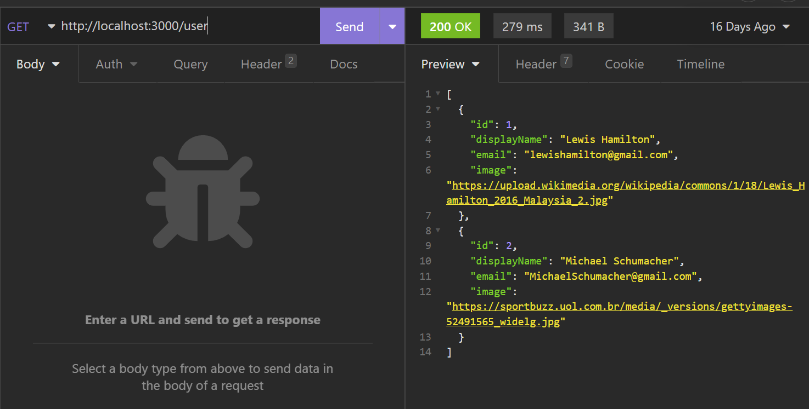
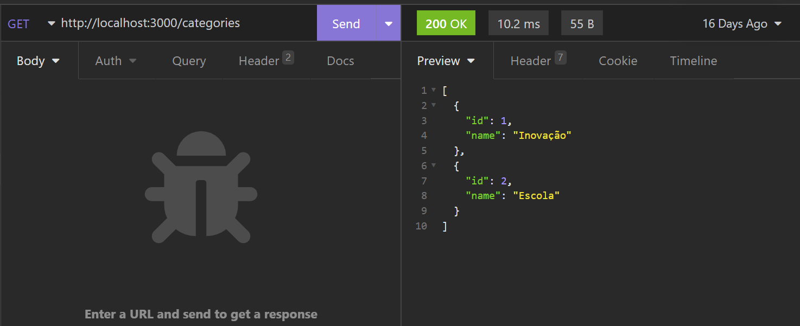
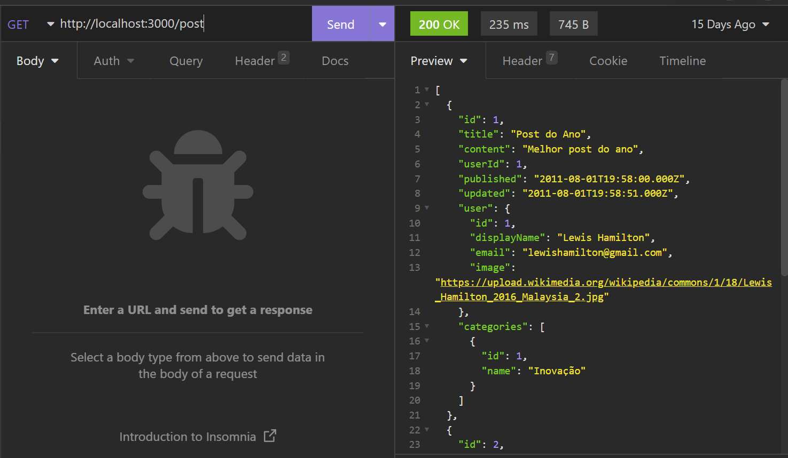

# Projeto API de blogs

## O objetivo desse projeto é subir um Back-end em NodeJs, Express e Sequelize, que vai servir a um blog pessoal!

### =============================================

## Como iniciar o projeto:

#### 0- Instale as dependencias usando ( npm install )
#### 1- Inicie o Docker na sua máquina
#### 2- Rode no terminal o comando ( docker compose up )
#### 3- Utilize o comando ( npm run dev ), o servidor vai estar rodando na porta 3000 por padrão

### =============================================

## Exemplos de chamada de rota usando o Imsomnia:
 

 
 
 

 
 
 

 

### =============================================

## Todas as rotas GET:

- http://localhost:3000/user
- http://localhost:3000/user/2
- http://localhost:3000/categories
- http://localhost:3000/post
- http://localhost:3000/post/1

## Todas as rotas POST:

- http://localhost:3000/login
- http://localhost:3000/user
- http://localhost:3000/categories

### =============================================

#### Projeto realizado em ( 08/2022 )

